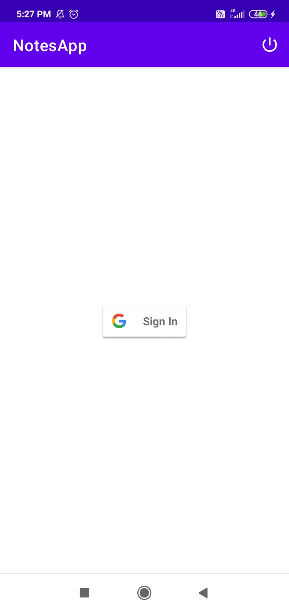
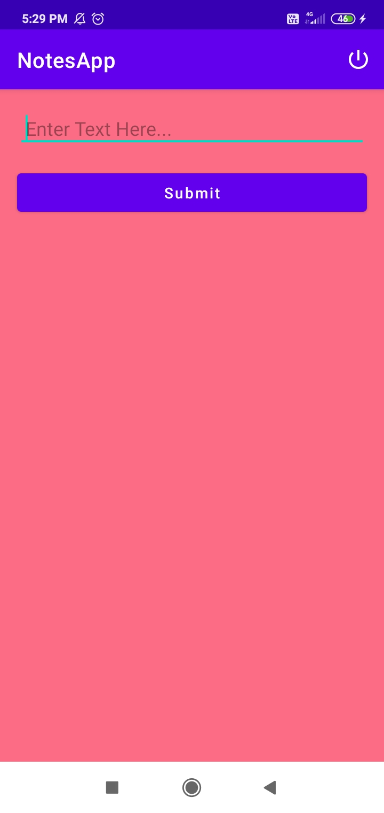
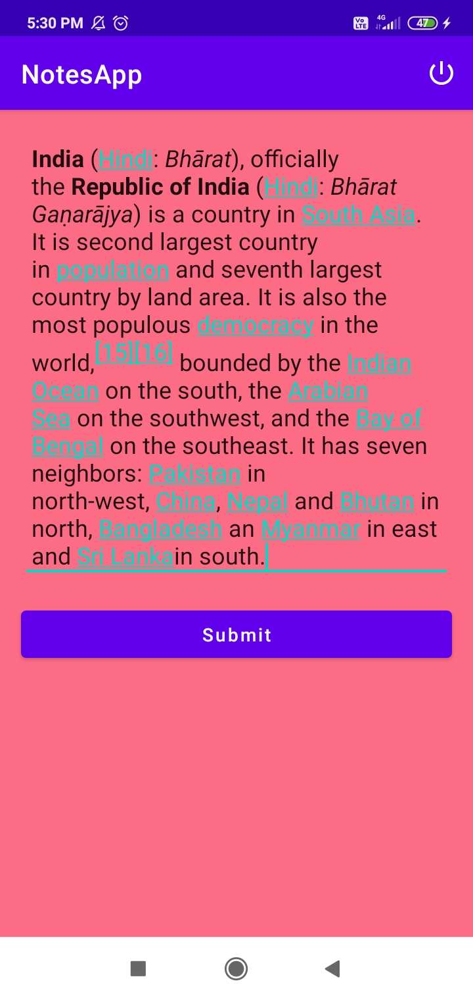
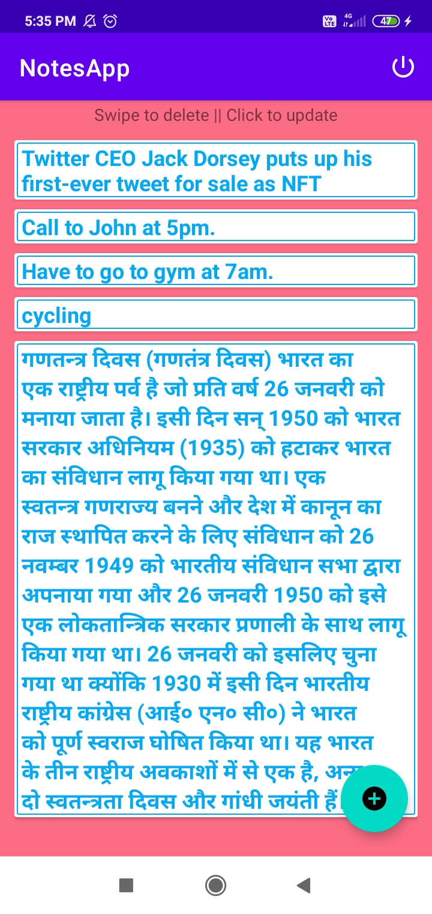

# NotesApp-Kotlin-MVVM-Room-SQLite-ViewModel-RecyclerView-LiveData-AndroidArchitectureComponents

It is a **Notes Taking** android application which is developed totally in *KOTLIN* language.

     

Following are some features of it -

* Create, Update and Delete notes
* **Delete** note by **Swiping the note in left/right** direction
* Click on a note to **Update** it
* Login using **Google**
* Have separate notes for every signed-in user

* Coded totally in **Kotlin**
* Implemented in **MVVM** design architecture/pattern
* Used **Room, SQLite, LiveData, ViewModel, RecyclerView** etc Android Architecture Components

**P.S.** 
* The **apk** file is also added in **releases section** of this repo
* **Stars** are always appreciated 😜

